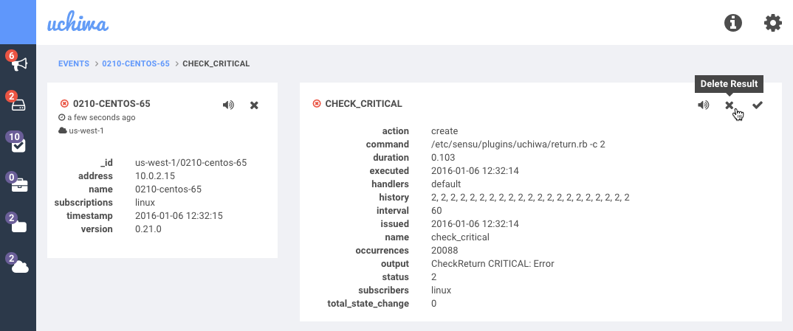

*Available in Uchiwa 0.14.0 and later. Depends on Sensu 0.21.0 and later*.

You can delete client check results directly from Uchiwa in case you need to clean up staled checks which were removed and no longer active.

To proceed, simply head over to the view of a specific check, then click on the *Delete Result* button as shown below:

Please note that deleting the result of a check that has an associated event will not resolve this event.
