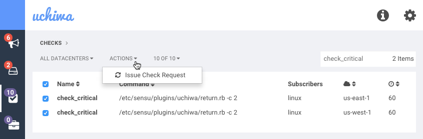

*Available in Uchiwa 0.14.0 and later*

You can issue a check execution request directly from Uchiwa. To do so, simply head over to the *checks* view, then pick all concerned checks and click on **Issue Check Request** under the **Actions** menu, as shown below:

Please note that every check is associated to a single datacenter so if you want to issue a check request across all datacenters, you will have to pick all relevant checks.
